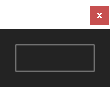

# 简介

TreeUI  （简称 Tree）是一款支持 `Ae` `Ps` `Ai` `Id` 的  `ScriptUI` 解析库。它基于 `Extend Script` 语言（ECMAScript 3标准的一个实现）构建。它提供了一种介于 ScriptUI 自身实现的 `add` 方法和 `Resource specifications` 构建形式之间的脚本 UI 构建方式，即使用多级树结构对象去描述并构建UI。可以帮助脚本开发者高效的开发脚本 UI。


下面是一个运行在 Ae 中的基本示例：

```javascript
//@include "tree.min.js"

Tree.parse({ button: [] });
```

结果展示



# 导入

根据你的使用场景和个人偏好，在使用 TreeUI 时，可以选择不同的导入方式


## 通过在脚本头部粘贴源码进行导入（推荐）

脚本通常具有绿色、轻量的优点，如果通过多文件管理代码，将失去脚本的这些优点，这是推荐该导入方式的原因。

```javascript
var Tree=function(){/*....*/}.call(this)
```

✏️ 推荐在生产环境中使用 `tree.min.js` ，即经过压缩的版本，这样可以有效减少脚本文件的体积。


## 通过 Extend Script 预处理指令导入

```javascript
//@include "tree.min.js"
```


## 上下文配置

如果你将 TreeUI 源码放置于全局环境下（即脚本的顶部，通常为第一行），或者不为 Ae 开发脚本，则可以跳过此环节，直接进入后面的章节：

```javascript
var Tree = function () {/*....*/}.call(this);

Tree.parse({ button: [] });
```

TreeUI 特别针对 Ae 封装了可停靠面板的逻辑代码，即运行在 `ScriptUI Panels` 目录下的脚本 UI 可以在 Ae 中进行停靠的特性。受限于可停靠的底层检测逻辑，必须向解析器传递全局环境作为判断依据，否则解析后的 UI 将无法正常在 Ae 中停靠。

下面为配置方法：

```javascript
(function (global) {
    var Tree = function () {/*....*/}.call(this);

    Tree.context = global;

    Tree.parse({ button: [] });
})(this);
```


## 全局变量

TreeUI 默认使用标识符 `Tree` 作为全局变量，TreeUI 的所有属性和方法都添加到这个变量。

如果你需要将 `Tree` 改为其他变量名，可以通过以下方式实现：

```javascript
var Foo = function () {/*....*/}.call(this);
Foo.parse({ button: [] });
```


# 兼容性

TreeUI 对 ScriptUI 有着完全的兼容性，并在此基础之上简化 UI 构建流程。兼容性主要体现在以下方面：

- 元素兼容：TreeUI 支持解析 ScriptUI 中的所有元素。
- 参数兼容：TreeUI 支持解析 ScriptUI 中所有元素的创建参数，且未对原有传参顺序进行调整。
- 样式兼容：TreeUI 支持解析 ScriptUI 中所有元素的样式属性。
- 组合兼容：TreeUI 完全同步 ScriptUI 中所有可能的元素组合方式。

当你已经熟悉 ScriptUI 传统的构建方式时，完全不需要花费更多额外的时间去学习一套新的理论，一切都是平滑过渡的。


# ScriptUI 基础

如果你从来没有了解过 ScriptUI，或知之甚少，那么阅读本章将会帮你快速建立 ScriptUI 知识框架，以便之后快速上手 TreeUI。

因为这不是一份描述 ScriptUI 的文档，所以本章不会过多描述 ScriptUI 的各种细节，如需获取完整信息，请阅读[官方文档](https://extendscript.docsforadobe.dev/user-interface-tools/index.html)。

✏️ 为了保证示例阅读的简洁性，本节及之后的示例代码中，将不会出现导入及配置 TreeUI 部分的代码。


## ScriptUI

ScriptUI 是 Adobe 提供的内置组件，它与 ExtendScript JavaScript 解释器一起工作，为 JavaScript 脚本提供创建用户界面元素并与之交互的能力。


## ESTK

全称 Adobe ExtendScript Toolkit CC，是 Adobe 专门为脚本编写设计的集成开发环境（IDE），包含 ScriptUI 的完整实现。它可以非常方便的让脚本在指定 Adobe 应用程序中运行，同时具备一些基本的调试功能。虽然官方早已停止维护该软件，但相对所有 Adobe 应用来说，它依然是目前最便捷的脚本调试工具。TreeUI 中的所有特性可以完整的在 ESTK 中展现，如果你当前处于学习阶段，那么推荐你直接在 ESTK 中运行下文中的案例。


## 宿主

宿主又称宿主应用，我们可以通俗的将宿主理解为 Adobe 公司开发的软件，一款软件就是一个宿主，比如 Ae 就是一个宿主。脚本依赖于宿主运行。不同的宿主在渲染 ScriptUI 元素外观时会有不同的策略，所以你会发现在 Ae 中运行良好的 UI，放到 Ps 中就会出现错误，甚至外观完全不同，这是正常的，如果你同时为多款 Adobe 应用程序开发脚本，处理这种差异，也是编写脚本的工作之一。在后面的章节中，将使用“宿主应用”指代“Adobe 应用程序”。


## 元素

元素是 ScriptUI 中对于容器与控件的统称，它们通常被“装”在操作系统的窗口中，属于窗口的 UI 元素可以是容器或控件。


## <span id="Container-Control">容器与控件</span>

ScriptUI 中的元素分为两大类，即容器与控件。

区分容器与控件是一件很基础却又很重要的事情。容器通常可以包含其它容器或控件，所谓包含，即我们可以向容器中添加容器和控件，但通常无法向控件中添加容器和控件。容器是我们组织 UI 布局的的基本框架和单元，我们可以把容器和控件分别比作计算机中的文件夹和文件，而主容器，即下文中将提到的 `Window` 就相当于计算机中的 C 盘、D盘。有些控件同时具有容器和控件的特征，继续阅读下面的内容，你将了解这些特征。


### 父子级

从容器度的角度说，装在容器中的容器或控件通常称作它的子级（child element），反之则为父级（parent element）。


### 元素名称与元素类型名称

元素名称是描述一个元素叫什么的书面用语，而元素类型名称则是在编程过程中作为方法参数传递的字符串，它是区分大小写的，所以之后涉及元素详情的表格中会相应的列出元素类型名称，以供参照。我们以元素类型名称 `button` 为例，以下示例展示了它被使用时的样子：

```javascript
var button = container.add('button');
```


### 容器

容器是组织 UI 中其它元素和布局的基本工具，它具有给元素“打组”并进行统一控制的能力。容器可以包含其它容器，也就是说容器可以进行多级嵌套。

容器有以下三种：

| 容器名称 | 类型名称 | 简述                                                         |
| -------- | -------- | ------------------------------------------------------------ |
| Window   | window   | 窗口容器，可以添加不包括自身在内的所有容器和控件，它是所有元素的主容器，所以任何容器都不能“装”它。 |
| Group    | group    | 组容器，可以添加包括自身在内的所有子容器和子控件。           |
| Panel    | panel    | 面板容器，可以添加包括自身在内的所有子容器和子控件。         |

一般最常使用的容器只有 `Group` 和 `Panel` 。

Window 容器有三种类型，且具有特定于操作系统的不同窗口外观：

| Window 类型 | 类型名称 | 简述                                                         |
| ----------- | -------- | ------------------------------------------------------------ |
| Dialog      | dialog   | 会生成一个学名叫“模态窗口”的窗口，这个窗口弹出时，你不能与窗口外的其它元素进行交互。 |
| Palette     | palette  | 俗称调色板，这个窗口弹出时，你可以与窗口外的其它元素进行交互，所以它是目前最受欢迎的窗口类型。 |
| Window      | window   | 与 dialog 无本质区别，在形式上（仅仅是形式上）可以用作应用程序的主窗口。事实上它很少在脚本开发中被使用。 |

✏️ TreeUI 会在内部生成一个默认的 Window 容器，所以你很少有机会和它打交道。但了解它的存在是必要的。

不同宿主应用对于 Window 类型的支持是存在差异的，下表展示了这些差异：

| Window 类型 | 类型名称 |  Ae  |  Ps  |  Ai  |  Id  | ESTK |
| ----------- | -------- | :--: | :--: | :--: | :--: | :--: |
| Dialog      | dialog   |  √   |  √   |  √   |  √   |  √   |
| Palette     | palette  |  √   |  ×   |  √   |  ×   |  √   |
| Window      | window   |  √   |  ×   |  √   |  ×   |  √   |

`√` 代表支持，`×` 代表不支持。

⚠️ 在没有显式定义主容器类型的情况下，TreeUI 会针对不同宿主提供相应的默认主容器类型，并以 `palette` 类型优先，其次是 `dialog` 。

⚠️ **如果向宿主应用提供了不支持的 Window 类型参数，TreeUI 会自动将类型转换为默认类型。**


### 控件

控件一般是 UI 中直接可见与可交互的元素，同时也是实现 UI 功能的主要载体。

下表简述了不同控件的功能：

| 控件名称      | 类型名称     | 简述                                           |
| ------------- | ------------ | ---------------------------------------------- |
| Button        | button       | 按钮                                           |
| Checkbox      | checkbox     | 复选框                                         |
| Dropdown List | dropdownlist | 下拉列表                                       |
| Edit Text     | edittext     | 输入框                                         |
| Flash Player  | flashplayer  | Flash 播放器。已被官方弃用，仅在 estk 中可用。 |
| Icon Button   | iconbutton   | 图标按钮                                       |
| Image         | image        | 图像                                           |
| Listbox       | listbox      | 列表                                           |
| Progress Bar  | progressbar  | 进度条                                         |
| Radio Button  | radiobutton  | 单选按钮                                       |
| Scrollbar     | scrollbar    | 滚动条                                         |
| Slider        | slider       | 滑杆                                           |
| Static Text   | statictext   | 静态文本                                       |
| Tabbed Panel  | tabbedpanel  | 选项卡                                         |
| Treeview      | treeview     | 树视图                                         |


### 特殊的控件

有些控件对父级存在特定的类型要求，所以它们不算常规意义上的控件，下表描述了这些特殊控件的特征：

| 控件名称 | 类型名称 | 特征                                                 |
| -------- | -------- | ---------------------------------------------------- |
| Item     | item     | 父级只能是 Dropdown List、Listbox、Tree View 或 node |
| Node     | node     | 父级只能是 Node （Node可以装Node）或 Tree View 控件  |
| Tab      | tab      | 父级只能是 Tabbed Panel                              |


### 特殊的容器

有些控件表现出容器的特征，即可以添加其它控件或容器，但可添加的子级类型通常是单一的，下表描述了这些特殊容器的特征：

| 控件名称      | 类型名称     | 特征                                         |
| ------------- | ------------ | -------------------------------------------- |
| Dropdown List | dropdownlist | 子级只能是 Item                              |
| Listbox       | listbox      | 子级只能是 Item                              |
| Tabbed Panel  | tabbedpanel  | 子级只能是 Tab                               |
| Tab           | tab          | 子级可以是不包括它自身在内的所有容器或控件。 |
| Treeview      | treeview     | 子级只能是 Node 或 Item                      |


## <span id="Element-combination">元素组合</span>

下表完整展示了 ScriptUI 中可能的父子元素组合方式，分隔线上方为父级，下方为子级，所有元素皆以类型名称表示：

|    组合一     |    组合二     |    组合三     |    组合四     |    组合五     |    组合六     |
| :-----------: | :-----------: | :-----------: | :-----------: | :-----------: | :-----------: |
|    window     |               |               |               |               |               |
|      tab      |               |               |               |               |               |
|     group     |               |               |               |               |               |
|     panel     | dropdownlist  |   treeview    |     node      |  tabbedpanel  |    listbox    |
| ============= | ============= | ============= | ============= | ============= | ============= |
|    button     |     item      |     item      |     node      |      tab      |     item      |
|   checkbox    |               |     node      |     item      |               |               |
| dropdownlist  |               |               |               |               |               |
|   edittext    |               |               |               |               |               |
|  flashplayer  |               |               |               |               |               |
|     group     |               |               |               |               |               |
|  iconbutton   |               |               |               |               |               |
|     image     |               |               |               |               |               |
|    listbox    |               |               |               |               |               |
|     panel     |               |               |               |               |               |
|  progressbar  |               |               |               |               |               |
|  radiobutton  |               |               |               |               |               |
|   scrollbar   |               |               |               |               |               |
|    slider     |               |               |               |               |               |
|  statictext   |               |               |               |               |               |
|  tabbedpanel  |               |               |               |               |               |
|   treeview    |               |               |               |               |               |


# TreeUI 快速入门


## 构建逻辑

TreeUI 使用多级树结构对象去描述并构建 UI。ScriptUI 的 `Resource specifications` ，即资源字符串构建就是该方式的一种实现，但由于它完全是字符串形态，所以非常难以调试，相应的，使用 ScriptUI 容器的 `add` 方法是典型的过程式开发，需要借助大量的中间变量，同时 UI 元素之间的层级关系非常模糊，这同样让调试变得困难。而 TreeUI 在这两种方法之间寻求平衡，它直接使用对象字面量表示方式描述 UI，你将同时拥有当前主流编辑器（如 VsCode）的语法高亮、代码提示和符合直觉的 UI 构建方式，元素之间的层级关系将变得一目了然，且非常易于调试，这些也正是 TreeUI 被开发的原因和价值所在。

如果现在有这样一个需求：构建一个 UI，UI中有一个面板，面板中有一个输入框和按钮，不考虑元素样式。下面的示例就分别展示了使用不同方式实现该需求的方法：

使用 add 方法

```javascript
var window = new Window('palette');
var panel = window.add('panel');
var editText = panel.add('edittext');
var button = panel.add('button');
window.show();
```

使用资源字符串

```javascript
var window = new Window('palette { \
    panel: Panel { \
        editText: EditText {}, \
        button: Button {} \
    }, \
}');
window.show();
```

使用 TreeUI

```javascript
var window = Tree.parse({
    panel: {
        editText: [],
        button: [],
    },
});
```


## 元素创建

TreeUI 始终使用对象键值对（我们通常叫对象的属性与值）描述 UI，即 key-value 形式。

```
{ name: 'Raymond Yan' }
```

以上代码使用一个对象描述一个人的姓名，那么在 TreeUI 中描述一个按钮，就是这样的：

```
{ button: [] }
```

其中 button 为[元素类型名称](#Container-Control)，`[]` 是一个定义按钮参数的数组，示例中是一个空数组，即代表不添加任何参数，而使用该元素的默认参数。

同样，你可以使用这种方法同时描述一个输入框和一个滑杆：

```
{
    editetext: [],
    slider: [],
}
```

然后使用 `Tree.parse` 方法解析它们，就像这样：

```javascript
var elements = Tree.parse({
    button: [],
    editetext: [],
    slider: [],
});
```

在 estk 中运行上面的代码，你就会看到一个包含按钮、输入框和滑杆的窗口，一切就是这么简单！

你甚至可以一次创建 ScriptUI 中所有的元素，看看它们的样子：

```javascript
var elements = Tree.parse({
    button: [],
    checkbox: [],
    dropdownlist: [],
    edittext: [],
    flashplayer: [],
    group: [],
    iconbutton: [],
    image: [],
    listbox: [],
    panel: [],
    progressbar: [],
    radiobutton: [],
    scrollbar: [],
    slider: [],
    statictext: [],
    tabbedpanel: [],
    treeview: [],
});

```

⚠️ 由于不同宿主对于 ScriptUI 控件类型的支持存在差异，以上示例中的元素，在个别宿主中会无法显示，具体支持情况参考下表：

为了保证阅读体验，下表仅对不支持的控件使用 `×` 进行标识。

| 控件类型     |  Ae  |  Ps  |  Ai  |  Id  | ESTK |
| ------------ | :--: | :--: | :--: | :--: | :--: |
| button       |      |      |      |      |      |
| checkbox     |      |      |      |      |      |
| dropdownlist |      |      |      |      |      |
| edittext     |      |      |      |      |      |
| flashplayer  |  ×   |  ×   |  ×   |  ×   |      |
| group        |      |      |      |      |      |
| iconbutton   |      |      |      |      |      |
| image        |      |      |      |      |      |
| listbox      |      |      |      |      |      |
| panel        |      |      |      |      |      |
| progressbar  |      |      |      |      |      |
| radiobutton  |      |      |      |      |      |
| scrollbar    |      |      |      |      |      |
| slider       |      |      |      |      |      |
| statictext   |      |      |      |      |      |
| tabbedpanel  |      |      |      |      |      |
| treeview     |      |  ×   |      |      |      |


## 元素嵌套

如果要将控件装入某个容器，形成一种组结构，只需定义一个容器类型名称作为键名、新对象作为值的对象，并将要装入容器的控件类型名称以键值对的方式依次表示在新对象中即可，它非常符合直觉，我们通过一个示例来说明这种直觉匹配。例如现在我需要一个组，组里套个组，组里再装个面板，面板中才是按钮，那自然可以这么写：

```javascript
var window = Tree.parse({
    group: {
        group: {
            panel: {
                button: [],
            },
        },
    },
});
```

⚠️ 嵌套中的父子级类型名称自然是要满足组合要求的，例如，你不能将一个组嵌套至一个按钮内，这显然是不合常理的。你可以在[元素组合](#Element-combination)一节中查阅所有支持的父子级元素类型名称的组合方式。

⚠️ **TreeUI 会跳过不满足父子级搭配的子级控件，且存在错误组合的子级的所有子级都不会被解析。**


## 冲突处理

由于 TreeUI 使用字面量对象作为解析源，当在对象同一层级中同时指定多个同类型控件或容器的类型名称时，将会不可避免的发生对象键值覆盖，下面的示例展示了这种冲突：

```javascript
var window = Tree.parse({
    button: [],
    button: [],
});
```

以上代码被执行后，你只会看到最后一个按钮被渲染，因为 TreeUI 只能解析到最后指定的 `button` ，而第一次指定则会因为对象不能具有同名键这一特性被覆盖了。

为了解决这种冲突，TreeUI 采取了一种通用的解决方案，即在元素类型名称后添加数字编号。

这种元素类型名称和数字编号的组合方式总是要求紧凑的，你不能在元素类型名称与数字之间加入其它符号，否则该元素将不被解析。

你可以这么做（推荐）：

```javascript
var window = Tree.parse({
    button1: [],
    button2: [],
});
```

也可以这么做：

```javascript
var window = Tree.parse({
    '01button': [],
    '02button': [],
});
```

但不能这么做：

```javascript
var window = Tree.parse({
    button_1: [],
    button_2: [],
});
```

编号的作用仅为避免覆盖冲突，所以连续的编号并不是必须的，你完全可以使用 button1、button3、button12 这种排列方式，这对结果不会有任何影响。

采用这种方式的一个考量是，使用数字编号可以得到一个整洁的代码排版，当批量创建一组同类型元素时，不会因为元素类型名称长短不一而损失可读性。


## 解析顺序

TreeUI 对于元素的解析顺序是自上而下、由外向内的，这就意味着，同一层级的元素，对象中的键值对越靠上的越先被解析，不同层级的，嵌套越浅的，越先被解析。


## 返回值

TreeUI 在成功完成解析后始终返回一个 `Window` 对象，它与在 ScriptUI 中使用 `new Window()` 生成的实例对象并无区别。`Window` 对象包含所有子容器和子控件。

你可以使用一个变量存储返回值：

```javascript
var elements = Tree.parse({ /*...*/ });
```

如果向 `Tree.parse` 方法传递一个非对象类型的值，TreeUI 返回 `null` ：

```javascript
var elements = Tree.parse(''); // return null
```

如果 TreeUI 在不支持的宿主环境中运行，会返回 `null` 。


## 节点名称

在元素创建一节中我们提到，`[]` 是一个定义元素参数的数组，那么对于所有常规的控件和容器来说，该数组的第一个参数永远是节点名称，它是一个字符串。

如果把解析后的 UI 比作一棵树，那么容器就是一根根枝干，控件就是枝干上的叶子。

那节点名是什么呢，节点名就是枝干和叶子的身份证号码——一个唯一的、不重复的字符串。有了它，我们就可以在 TreeUI 解析完所有元素之后精准地读取它们，换言之，如果你从未定义过元素的节点名，那么在解析完成后，你将无法读取这些元素，虽然可以看到它们。

元素的节点名称这么定义：

```javascript
var elements = Tree.parse({ button: ['myButton'] });
```


## <span id="Split-Parameters">参数拆分</span>

在 ScriptUI 中，定义一个元素的外观，通常需要定义元素的两个部分，即创建参数和元素属性。创建参数是元素在解析前，向解释器预先提供的一组参数，通常包含：元素类型、元素尺寸、元素内容和个别特定于元素的创建属性等，并以此预定义元素的外观。元素属性是元素在解析后，通过写入对象属性的方式二次改变元素的外观。

而 TreeUI 可以一次性的在元素描述阶段，通过参数拆分的方式，同时向解释器提供创建参数和元素属性。

我们还是以创建一个按钮为例，这是参数被拆分前的样子：

```javascript
var elements = Tree.parse({
    button: ['myButton'],
});
```

这是拆分后的样子：

```javascript
var elements = Tree.parse({
    button: {
        style: { enabled: false },
        param: ['myButton'],
    },
});
```

你会发现，此时并没有向 `button` 提供一个数组类型的参数列表，而是提供了一个对象，这个对象包含两个属性，分别是 `style` 和 `param` 。原本定义元素参数的数组被挪到了 `param` 的后面，而 `style` 后面是一个对象，对象中写着 `enabled: false` 。如果你在 estk 中运行这段代码，你将会得到一个无法点击的按钮，这是因为 enabled 在 ScriptUI 中是按钮元素的一个属性，用于控制元素是否可以被交互。

不过，在 TreeUI 中我们将属性称作样式，也就是 `style`，明确这种称呼的变化，是非常必要的，因为在 TreeUI 中，每个元素都可以按照这种方式进行参数拆分。同时也意味着，`param` 和  `style` 是两个固定属性，如果你写成下面这样，相信我，它们一定不会生效：

```javascript
var elements = Tree.parse({
    button: {
        Style: { enabled: false },
        parameter: ['myButton'],
    },
});
```

✏️ 以上代码的参数部分不会被 TreeUI 解析，但你会得到一个默认外观且可点击的按钮。

说到这，我们就可以补充一个在节点名一节中没有明确的点——容器的节点名怎么定义呢？因为之前的示例中，它的类型名称后从来都是对象，对象中定义的都是容器包含的其它元素。

显然，现在我们可以很好的回答这个问题了，容器的节点名使用参数拆分的方式定义（当然，容器的参数可以不进行拆分，但这么做估计不会有什么太大的意义，毕竟容器就是用来装其它东西的。），而且还可以顺便定义容器的样式：

```javascript
var elements = Tree.parse({
    group: {
        style: { orientation: 'row' },
        param: ['myGroup'],
        button1: ['myButton1'],
        button2: ['myButton2'],
    },
});
```

在 estk 中运行以上示例，你将得到两个横向排列的按钮。这显然是样式（没错，叫样式，不叫属性） `orientation`  的功劳，你看，`orientation` 的值是字符串 `row` ，也就是将子元素排成一行的意思。另外我们还发现，button1 和 button2 的参数还是以未拆分的形式定义的，这说明参数拆分的另一个特点——拆分对于当前定义的任何元素来说，都是可选的，拆与不拆，完全看你的需求。


## 元素读取

⚠️ 只有在定义了节点名称的情况下，元素才能够被读取。

元素的读取主要有以下两种方式：

### 使用对象点语法读取元素

我们知道，TreeUI 解析后的返回值是一个 Window 对象，既然是对象，那必然可以按对象的方式进行读取：

```javascript
var elements = Tree.parse({
    group: {
        style: { orientation: 'row' },
        param: ['myGroup'],
        button1: ['myButton1'],
        button2: ['myButton2'],
    },
});

var myGroup = elements.myGroup;
var myButton1 = myGroup.myButton1;
var myButton2 = elements.myGroup.myButton2;
```

当然，也可以使用中括号，这在节点名称是个变量的时候特别有用：

```javascript
var index = [1, 2];
var myGroup = elements['myGroup'];
var myButton1 = myGroup['myButton' + index[0]];
var myButton1 = myGroup['myButton' + index[1]];
```


### 使用 ScriptUI 自有的 findElement() 方法

当获取的元素嵌套较深时，使用该方法显然是最好的选择。

```javascript
var elements = Tree.parse({
    group: {
        style: { orientation: 'row' },
        param: ['myGroup'],
        button1: ['myButton1'],
        button2: ['myButton2'],
    },
});

var myGroup = elements.findElement('myGroup');
var myButton1 = elements.findElement('myButton1');
var myButton2 = elements.findElement('myButton2');
```

⚠️ `findElement` 方法始终返回第一次匹配到的节点名对应的元素，而不是全部，所以，请始终保持节点名称的唯一性。


## 程序容错

作者将 TreeUI 的一般受众定义为非科班的开发人员，所以在程序容错方面做了很多工作。因为相比因个别参数错误导致整个程序无法运行而言，先有一个能跑但不完美的程序，再去调试，会对新手更加友好。你可以缺省绝大多数参数，甚至传入一些非法值，这意味着，你将很少有机会看到因传参不当导致的报错信息，程序会自动忽略哪些非法传参，并使用默认参数进行替补。如果你在开发过程中传入某些参数后，并没有显示预期的结果，恳请仔细阅读该文档中涉及参数的细节，确保你已完全了解参数的类型和边界。这是权衡的结果，也请专业开发者理解。


# 参数

TreeUI 直接映射了 ScriptUI 的参数，**仅将第一个参数由原本的元素类型名称改为了节点名称**。

以 button 控件在官方文档中的签名为例：

```
w.add ("button" [, bounds, text, creation_properties}]);
```

⚠️ 字符串 `"button"` 就是元素类型名称，在 TreeUI 中，**这个位置的参数将被用于定义元素节点名称**，而不再是元素类型名称。

| 参数名称       | 描述                                                         |
| -------------- | ------------------------------------------------------------ |
| bounds         | 可选的。控件的位置和大小。                                   |
| text           | 可选的。控件中显示的文本。                                   |
| creation_props | name：控件的唯一名称。对于模态对话框，特殊名称ok使其为defaultElement，特殊名称cancel使其为父对话框的cancelElement。 |

在 ScriptUI 中，参数这么用：

```javascript
var window = new Window('palette');
var button = window.add('button', [0, 0, 100, 25], '按钮', { name: 'myButton' });
window.show();
```

而 TreeUI 中，参数这么用：

```javascript
var window = Tree.parse({ button: ['myButton', [0, 0, 100, 25], '按钮'] });
```

你会发现 最后一个叫 `creation_props` 的参数，在以上示例中并没有被使用，那是因为 button 的 `creation_props` 只有一个叫 name 的可配置属性，而这个 name 就是元素的节点名称，所以，只需要按照 TreeUI 的规则，在数组的第一个元素位置定义它即可，无需重复定义，虽然以下的写法是可以的，但没必要：

```javascript
var window = Tree.parse({ button: ['myButton', [0, 0, 100, 25], '按钮', { name: 'my_button' }] });
```

⚠️ 以上操作会导致先定义的节点名 `myButton` 被后定义的 `my_button` 覆盖。

如果一个元素的 creation_props 具有 name 之外的可配置属性，就可以专门用上它了，下面以 edittext 为例，通过[查阅](https://extendscript.docsforadobe.dev/user-interface-tools/control-objects.html#edittext)官方文档，我们得知 editetext  除了 name ，一共有 6 个可配置属性，如果在 TreeUI 中把它们全都用上，就是这样：

```javascript
var window = Tree.parse({
    editetext: [
        'myEditText',
        [0, 0, 100, 25],
        '按钮',
        {
            readonly: false,
            noecho: false,
            enterKeySignalsOnChange: false,
            borderless: false,
            multiline: false,
            scrollable: true,
        },
    ],
});
```


可以通过以下入口查阅元素的所有可用参数：

- [窗口](https://extendscript.docsforadobe.dev/user-interface-tools/window-object.html#window-object-constructor)

- [控件](https://extendscript.docsforadobe.dev/user-interface-tools/control-objects.html#control-types-and-creation-parameters)
- [容器](https://extendscript.docsforadobe.dev/user-interface-tools/control-objects.html#control-types-and-creation-parameters)


# 样式

TreeUI 直接映射了 ScriptUI 的属性，并称作样式，通过[参数拆分](#Split-Parameters)的方式提供给元素。

以下示例展示了如何使用样式定义按钮的文字和大小：

```javascript
var elements = Tree.parse({
    button: { style: { text: '按钮', size: [100, 100] } },
});
```

✏️ 按钮的文字和大小其实可以直接通过参数定义，像这样：

```javascript
var elements = Tree.parse({
    button: { param: ['myButton', [0, 0, 100, 100], '按钮'] },
});
```

⚠️ 如果对元素同时使用参数和样式，并且功能存在重叠，则参数会被样式覆盖：

```javascript
var elements = Tree.parse({
    button: {
        param: ['myButton', [0, 0, 100, 100], '按钮'],
        style: { text: 'Ok', size: [50, 50] },
    },
});
```

以上代码执行后，你会得到一个 50 × 50 的按钮，且按钮上的文字是“Ok”，所以请避免同时使用功能重叠的参数和样式。


你可以在[这里](https://extendscript.docsforadobe.dev/user-interface-tools/common-properties.html)找到元素所有可以配置的样式。

✏️ 通过查阅官方文档你会发现，不是所有样式在任何元素上都是可用的。

如果需要进行针对性的查找，可以使用以下入口：

- [窗口](https://extendscript.docsforadobe.dev/user-interface-tools/window-object.html#window-object-properties)

- [控件](https://extendscript.docsforadobe.dev/user-interface-tools/control-objects.html#control-object-properties)
- [容器](https://extendscript.docsforadobe.dev/user-interface-tools/window-object.html#container-properties)


# 自定义控件

TreeUI 在 ScriptUI 原有控件之外，封装了一组自定义控件，以满足开发者对控件外观及功能的更多需求。

自定义控件是元素控件类型的一种。控件适用的特性对自定义控件依旧适用。

✏️ TreeUI 分别为不同的宿主提供与宿主默认主题一致的外观，所以在不同宿主中，自定义控件的默认外观并不相同。


## rectbutton 和 roundbutton

圆形按钮和矩形按钮有着完全一致的可配置属性，两者的区别仅仅是类型名称及外观差异而已。

创建一个空白的矩形按钮：

```javascript
Tree.parse({ rectbutton: [] });
```

创建一个空白的圆形按钮：

```javascript
Tree.parse({ roundbutton: [] });
```

与 ScriptUI 现有的按钮一样，自定义按钮的传参顺序依次为：

```javaScript
rectbutton: [节点名称, 按钮大小, 按钮文字, {创建属性}]
roundbutton: [节点名称, 按钮大小, 按钮文字, {创建属性}]
```

按钮的外观配置主要指对于`{创建属性}`的配置，它是一个对象。

我们通过一个实际案例来演示如何配置这些属性。为了方便参照，以下属性均为宿主 Ae 中使用的默认值：

```javaScript
Tree.parse({
    rectbutton: [
        'button',
        undefined,
        '按钮',
        {
            enableText: true, //是否显示按钮上的文字
            enableFill: true, //是否启用对按钮的填充
            enableStroke: true, //是否启用对按钮的描边
            fontName: 'Tahoma', //按钮字体，你一定很想知道都可以换成哪些字体，并且应该怎么输入。方法就是打开你的AE，然后开启字符面板，将面板右上角的三横杠菜单点开，勾选“显示英文字体名称，然后你会发现，字符面板里的所有字体名称都变成了英文，没错，这些英文就是可以写在这里的参数，复制粘贴即可（嗯，真的有很多字体，所以我并无打算把他们都列在文档里）。”
            fontStyle: 'REGULAR', //按钮字体样式，可选参数有：REGULAR|BOLD|ITALIC|BOLDITALIC
            fontSize: 12, //按钮文字大小
            fontOffset: [0, 0], //按钮文字的偏移量。这可能是个莫名其妙的属性，因为ScriptUI对字体边界的计算，相对不同字体而言总是不一致的（这是 ScriptUI 的BUG），所以，你在更换某个字体后，大概率会发现文字并没有水平垂直居中，身为强迫症的你，这个属性可能是救命稻草。该属性是有2个元素的数组，分别对应横向与纵向的文字偏移量（单位是像素），正值向右/下偏，负值向左/下偏。
            fontColor: ['#161616', '#8a8a8a', '#161616', '#ffffff'], //按钮在四个阶段分别对应的文字颜色
            fillColor: ['#8a8a8a', '#232323', '#636363', '#2d8ceb'], //按钮在四个阶段分别对应的填充颜色
            strokeColor: ['#8a8a8a', '#8a8a8a', '#636363', '#2d8ceb'], //按钮在四个阶段分别对应的描边颜色
            fontOpacity: [1, 1, 1, 1], //按钮在四个阶段分别对应的字体透明度
            fillOpacity: [1, 1, 1, 1], //按钮在四个阶段分别对应的填充透明度
            strokeOpacity: [1, 1, 1, 1], //按钮在四个阶段分别对应的描边透明度
            strokeWidth: [2, 2, 2, 2], //按钮在四个阶段分别对应的描边粗细
        },
    ],
});
```

所有的属性都是可以缺省的，这意味着，你只需配置你关注的属性，而不必把所有属性都罗列出来。

例如，你只是想将按钮上文字的字体换成楷体：

```javaScript
Tree.parse({ rectbutton: ['button', undefined, '按钮', { fontName: 'KaiTi' }] });
```

又或者，你想把默认状态下按钮的填充色改成红色，并把描边去掉，你可以这么写：

```javaScript
Tree.parse({ rectbutton: ['button', undefined, '按钮', { enableStroke: false, fillColor: [, '#e81123'] }] });
```

细心的你可能已经发现了，fillColor是一个四个元素的数组，但示例中只传了一个参数。的确是这样，你完全可以在数组对应位置（显然逗号还是不能省的）只传入一个参数，解析器知道你想做什么。

不仅如此，颜色、透明度和描边属性还可以直接按以下方式传参，他表示四种状态下都使用同一个参数：

```javaScript
Tree.parse({ rectbutton: ['button', undefined, '按钮', { enableStroke: false, fillColor: '#e81123' }] });
```

这时候你就拥有了一个纯红色的按钮，并且任何鼠标状态下都是这个颜色。

所有参数都是支持缺省的，另外如果你发现配置了参数之后，按钮的外观并没有发生改变，那么只有两种可能，一是你的参数是无效的，二是你的参数超出了最大限制，所有非法输入被检测到后，都会使用默认参数进行替补。


# 主容器配置

每个 `TreeUI.parse` 方法的源中，都可以通过标识符 `config` 在根位置同时写入一个或多个配置参数。


## dockable

类型：`Boolean`

默认为 true。配置主容器是否可以在AE中停靠。

示例：

```javascript
var Window = Tree.parse({
    config: { dockable: false },
    button: [],
});
```

以上示例运行后将始终无法在 Ae 中停靠面板。


## show

类型：`Boolean`

默认为 true。配置主容器是否在创建后显示。

示例：

```javascript
var Window = Tree.parse({
    config: { show: false },
    button: [],
});
```

以上示例运行后将不会在宿主中显示窗口，必须对 window 使用 ScriptUI 自有的 `show()` 方法才能够显示：

```javascript
var Window = Tree.parse({
    config: { show: false },
    button: [],
});
window.show()
```


## singleton

类型：`Boolean`

默认为 false。单例模式。启用后 TreeUI 返回一个方法，调用该方法可创建单例面板，无论调用该方法多少次，面板只会被创建一次,特别适用于构建脚本的参数配置面板。

以下示例展示了单例模式的用法：

```javascript
var configWindow = Tree.parse({
    config: { singleton: true },
    checkbox: [undefined, undefined, '启用'],
});

var mainWindow = Tree.parse({
    button: {
        style: { onClick: configWindow },
        param: [undefined, undefined, '设置'],
    },
});
```

运行以上代码，你首先会看到一个叫“设置”的按钮，点击它，会弹出一个新的窗口，窗口中有个可以点击的复选框。


# 属性

### Tree.version

类型：`String`

只读。一个包含 TreeUI 版本信息的字符串。


### Tree.context

类型：`Global Object`

只写。一个指向当前脚本运行上下文的对象。


### Tree.layoutMode

类型：`Number`

只写。默认为 0，用于配置全局 layout 模式，只可写入以下值：

| 值   | 描述                                                         |
| ---- | ------------------------------------------------------------ |
| 0    | 如果容器边界（即大小+位置）已经设置，则不执行任何操作。否则，让布局管理器对该容器和任何子容器进行操作。 |
| 1    | 强制布局管理器重新计算子容器的大小。                         |
| 2    | 内部使用。当子容器有“填充”对齐时涉及。                       |


# 方法

### Tree.parse()

`Tree.parse(source)`

| 参数   | 类型   | 描述                   |
| ------ | ------ | ---------------------- |
| source | Object | 一个用于描述 UI 的对象 |

返回一个 `window` 对象。当 source 不是对象时，返回 null 。


# 代码示例

## 创建一个空白按钮

```javascript
Tree.parse({ button: '' });
```


##  添加节点名称并设置事件

```javascript
var elements = Tree.parse({
    button1: ['run'],
});

elements.run.onClick = function () {
    alert('Yoooooo!');
};
```


## 将事件通过样式写入

```javascript
function foo() {
    alert('Yoooooo!');
}

var elements = Tree.parse({
    button1: {
        style: { onClick: foo },
        param: ['run'],
    },
});
```


## 为按钮添加更多样式

```javascript
function foo() {
    alert('Yoooooo!');
}

var elements = Tree.parse({
    button1: {
        style: { onClick: foo },
        param: ['run', [0, 0, 100, 30], '按钮'],
    },
});
```


## 配置全局主容器的样式

```javascript
function foo() {
    alert('Yoooooo!');
}

var elements = Tree.parse({
    style: { margins: 5, alignChildren: ['fill', 'fill'] },
    param: ['palette', '', undefined, { resizeable: true }],
    button1: {
        style: { onClick: foo },
        param: ['run', [0, 0, 100, 30], '按钮'],
    },
});
```


## 单例面板

```javascript
var configWindow = Tree.parse({
    config: { singleton: true },
    checkbox: [undefined, undefined, '启用'],
});

var mainWindow = Tree.parse({
    button: {
        style: { onClick: configWindow },
        param: [undefined, undefined, '设置'],
    },
});
```


## 构建更复杂的 UI

```javascript
function foo() {
    alert('Yoooooo!!!');
}

var elements = Tree.parse({
    style: { margins: 5, alignChildren: ['fill', 'fill'] },
    param: ['palette', '', undefined, { resizeable: true }],
    group1: {
        style: { margins: 0, spacing: 0, orientation: 'column', alignChildren: ['fill', 'fill'] },
        param: ['mainGroup1', undefined, undefined],
        edittext1: {
            style: { preferredSize: [180, 230] },
            param: ['console', undefined, 'console', { multiline: true, scrolling: true }],
        },
    },
    group2: {
        style: { orientation: 'column', alignChildren: ['fill', 'fill'], alignment: ['fill', 'bottom'] },
        param: ['paramGroup1', undefined, undefined],
        group1: {
            style: { orientation: 'row', alignment: ['fill', 'bottom'] },
            param: ['dropdownlistGroup'],
            statictext1: [undefined, [0, 0, 30, 25], '方向'],
            dropdownlist1: {
                style: { alignment: ['fill', ''], selection: 3 }, //定义下拉列表的默认选项
                param: ['direction', [0, 0, 170, 25], ['+x', '-x', '+y', '-y']],
            },
        },
        group2: {
            style: { spacing: 5, orientation: 'row', alignChildren: ['fill', 'fill'], alignment: ['fill', 'bottom'] },
            param: ['settingGroup'],
            group1: {
                style: { orientation: 'column', alignment: ['left', 'bottom'] },
                param: ['mainGroup'],
                statictext1: ['time', [0, 0, 30, 25], '时间'],
                statictext2: ['transition', [0, 0, 30, 25], '过渡'],
                statictext3: ['distance', [0, 0, 30, 25], '距离'],
            },
            group2: {
                style: { orientation: 'column', alignChildren: ['fill', 'fill'] },
                param: ['mainGroup'],
                slider1: ['time', [0, 0, 140, 25], 1, 0, 3],
                slider2: ['transition', [0, 0, 140, 25], 1, 0, 3],
                slider3: ['distance', [0, 0, 140, 25], 1, 0, 3],
            },
            group3: {
                style: { orientation: 'column', alignment: ['right', 'bottom'] },
                param: ['mainGroup'],
                edittext1: ['time', [0, 0, 45, 25], '10'],
                edittext2: ['transition', [0, 0, 45, 25], '10'],
                edittext3: ['distance', [0, 0, 45, 25], '10'],
            },
        },
    },
    button1: {
        style: { onClick: foo }, //添加事件侦听
        param: ['button', undefined, '添加'],
    },
});
```


